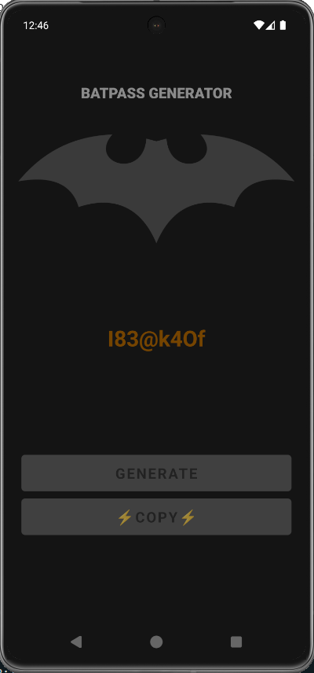

# Bat Pass App

## Introdução

Explicar conceitos fundamentais do React Native, como a compreensão de componentes e a estrutura de um projeto. No React Native, a interface do usuário é construída a partir de componentes, que são blocos reutilizáveis de código responsáveis por renderizar partes da tela e gerenciar seu próprio estado e comportamento. 

A estrutura de um projeto React Native geralmente inclui pastas separadas para componentes, telas (screens), assets (imagens, fontes), e arquivos de configuração. Isso facilita a organização e manutenção do código, permitindo que cada parte do aplicativo seja desenvolvida e testada de forma independente. O uso de componentes promove a reutilização e a escalabilidade do projeto, tornando o desenvolvimento mais eficiente e modular.

## App Screen



## Funcionalidades

- Geração de senhas aleatórias

## Tecnologias Utilizadas

- [React Native](https://reactnative.dev/)
- [Expo](https://expo.dev/)
- [React Navigation](https://reactnavigation.org/)
- [TypeScript](https://www.typescriptlang.org/)

## Como Rodar o Projeto

1. Clone o repositório:
  ```bash
  git clone https://github.com/seu-usuario/bat-pass-app.git
  ```
2. Acesse a pasta do projeto:
  ```bash
  cd bat-pass-app
  ```
3. Instale as dependências:
  ```bash
  npm install
  ```
4. Inicie o projeto:
  ```bash
  npx expo start
  ```
5. Use o aplicativo Expo Go para escanear o QR code exibido e rodar o app no seu dispositivo móvel ou rode em um emulador de sua preferência.

---